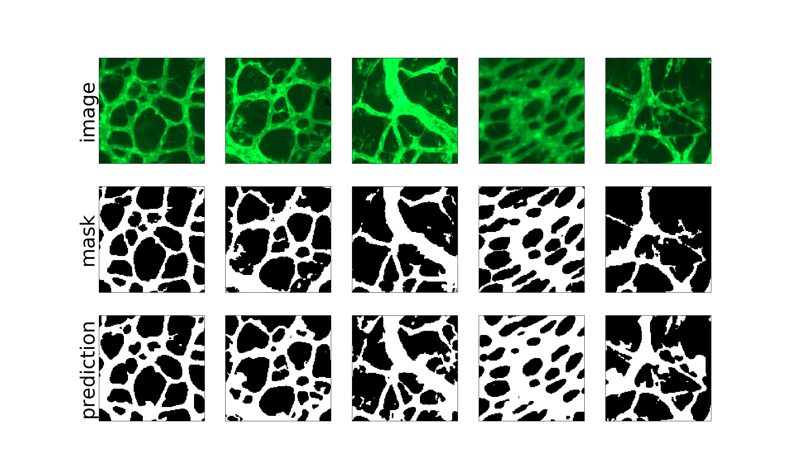
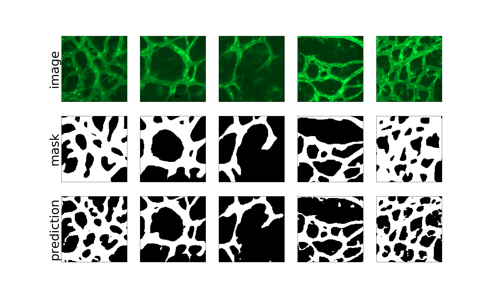

# Blood Vessel Network Analysis

This repository was created to implement a blood vessel network analysis.

## Setup
Create a venv, e.g., `conda create -n vessel-network python=3.7.2`.
Then activate the venv and install the required packages using 
```
conda activate vessel-network
pip install -r requirements.txt
```

## Blood Vessel Segmentation
First, save training and validation data (images and masks) in `data/train_data` and `data/validation_data`, respectively.
To train the U-Net model run
```
cd segmentation
python train_unet.py
```
Our model can be trained with either GPU or CPU. CUDA version 11.0 or above and cuDNN version 8.0 or above are needed to train the model on GPU.
`conda install -c nvidia cudnn` will let you download the newest version of CUDA and cuDNN.

Save test data (images) in `data/test_data`, then to generate predicted masks run
```
python test_unet.py
```
You can adjust hyperparameters in both scripts but should use the same `PATCH_SIZE` and `LOG_NUM`. Pretrained weights are also available in `segmentation/ckpt_1`.

After training the U-Net with the current hyperparameters, we get the following results:  

The comparison plot of image, mask, and prediction patches for the train data looks like


, and the one for the validation data looks like



## Vessel Network Reconstruction & Network Feature Extraction
We reconstruct a vessel network using the predicted binary images in `data/test_data/predictions`. To construct a vessel network, run
```
cd ../feature_extraction
feature_extraction.py
```
The reconstructed network is saved in `feature_extraction/feature` as `imagename_network.png`.           
The above code also extracts the features of the network (e.g., vessel length, branching point, vessel segment, tortuosity, etc.) and they are saved in `feature_extraction/feature` as `imagename_alldata.xlsx` and `imagename_degreedata.xlsx`.

## Vessel Network Analysis

